# 🧼 SkillHire - Service Finder Mobile Application

> A cross-platform mobile application that helps users **find and book skilled services** (e.g., plumbers, cleaners, electricians) nearby, while enabling professionals to showcase their expertise and earn.

[](https://github.com/NganeEmmanuel/Cleaning-service)

---

## 📱 Project Description

**SkillHire** is a React Native application built using Expo. It connects **service providers** with **clients** looking for skilled labor, simplifying the often cumbersome process of finding trusted professionals. This centralized platform offers real-time communication (via WhatsApp), booking management, and secure user authentication using Clerk.

The backend is handled through **Hygraph**, a headless CMS built on GraphQL, which enables flexible and scalable content modeling and data delivery.

---

## 📈 Impact and Use Cases

- Helped **digitize local labor market** access in underserved communities
- Bridged the gap between **clients and skilled workers**
- Created a **revenue-generating platform** for tradespeople and professionals

---

## 🚀 Key Features

- 🔐 **Authentication & User Management** with Clerk
- 🔍 **Search & Filter Services** by category, recency, or keyword
- 📆 **Book a Service** directly from the app
- 💬 **Chat with Service Providers** via WhatsApp integration
- 👤 **Service Provider Dashboard** for adding, managing, and deleting listings
- 📄 Clean UI/UX, optimized for both Android and iOS

---

## 🎯 Target Audience

- Individuals seeking skilled services across Cameroon
- Freelancers and professionals offering services
- Users from all demographic backgrounds, especially non-tech-savvy users

---

## 🛠️ Technologies Used

| Layer                  | Tech Stack                              |
|------------------------|------------------------------------------|
| Frontend               | React Native (Expo)                     |
| Backend / CMS          | Hygraph (GraphQL)                       |
| Authentication         | Clerk                                   |
| State Management       | React Hooks, Context API                |
| API Testing            | Manual Testing + GraphQL Playground     |
| DevOps & VCS           | Git + GitHub                            |
| Project Management     | Trello (Scrum-style workflow)           |

---

## 🧱 Project Structure

```
/Cleaning-service
│
├── assets/                 # App assets (images, icons, etc.)
│   ├──App/
│   ├── common/                    # Shared UI components (buttons, cards, etc.)
│   ├── navigation/                # Stack and Tab navigators
│   ├── screen/                    # All app screens
│   │   ├── Bookingscreen/
│   │   ├── HomeScreen/
│   │   ├── LatestServiceScreen/
│   │   ├── LoginScreen/
│   │   ├── MyservicesScreen/
|   │   ├── ProfileScreen/
│   │   └── SearchServiceScreen/
│   │   └── ServiceDetailsScreen/
│   │   └── ServiceListByCategoryScreen/
│   │
│   ├── utils/                     # Utility functions (formatting, helpers)
│   ├── hooks/                     # Custom React hooks
│   ├── components/             # Reusable UI components
│   ├── navigation/             # Tab and stack navigators
├── App.js                  # Entry point
├── app.json                # Expo config
├──B babel.config.js            
├── eas.json            
├── package.json
├── package-lock.json            
└── README.md               # You are here 😎
```

## 🧩 Architecture Overview

**Three-Tier Architecture**

- **Presentation Layer:** React Native + Expo
- **Business Logic Layer:** Hygraph + Clerk integration
- **Data Layer:** Hygraph CMS (services, users, bookings)

### Diagram Overview

```
User (Mobile App)
   ↓
React Native (UI)
   ↓
Clerk (Auth) ─── Hygraph (GraphQL CMS)
   ↓
   Data (Users, Bookings, Services)
```

> This layered design ensures separation of concerns, scalability, and modularity.

---

---

## 🧰 System Design & Visual Documentation

SkillHire was designed using proven architectural and design methodologies to ensure clarity, maintainability, and scalability. Below are key visual assets and diagrams used during development.

---

### 🏛️ Architecture Diagram

The following diagram illustrates the **three-tier architecture** including the presentation, business logic, and data layers.


> 📌 *This diagram shows how React Native communicates with Clerk for Auth and Hygraph via GraphQL for content management.*

---

### 🧩 Use Case Diagram

This diagram highlights how users interact with the application: service discovery, booking, messaging providers, and managing personal services.

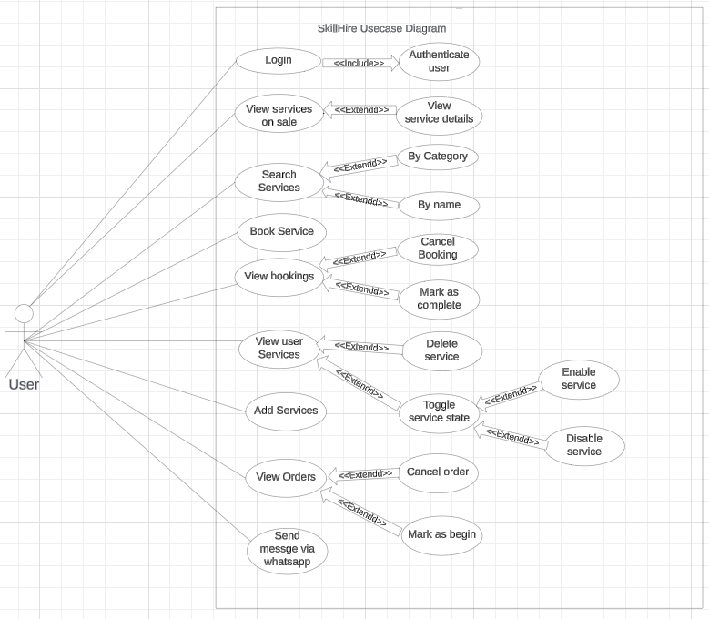
> 👥 *Shows user roles and their corresponding actions within SkillHire.*

---

### 📦 Class Diagram

Displays the core components of the application, data models (User, Booking, Service), and how they relate.

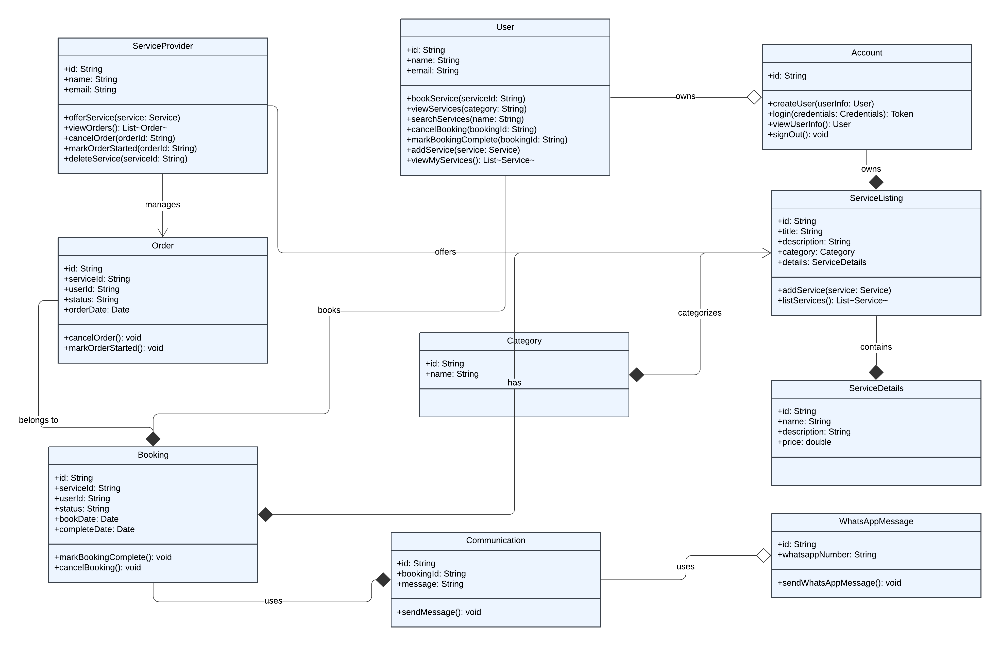
> 🧠 *Helpful for understanding data flow, GraphQL schema modeling, and entity relationships.*

---

---

### 🎨 Wireframes & UI Mockups

Early sketches of the app layout and UX design across core screens:

| Screen                  | Wireframe                                           |
|-------------------------|-----------------------------------------------------|
| Home Screen             | 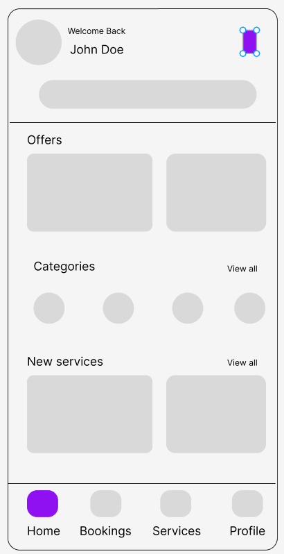    |
| Booking Screen          | 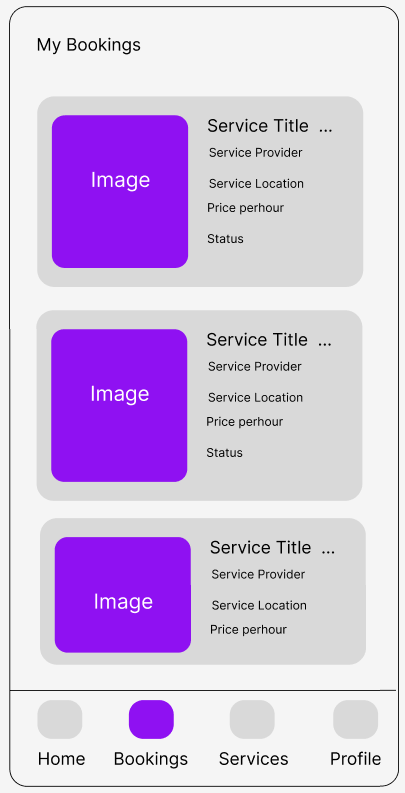 |
| My Services             | 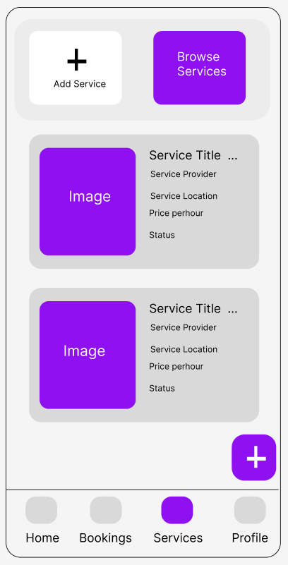 |
| Profile Screens   | 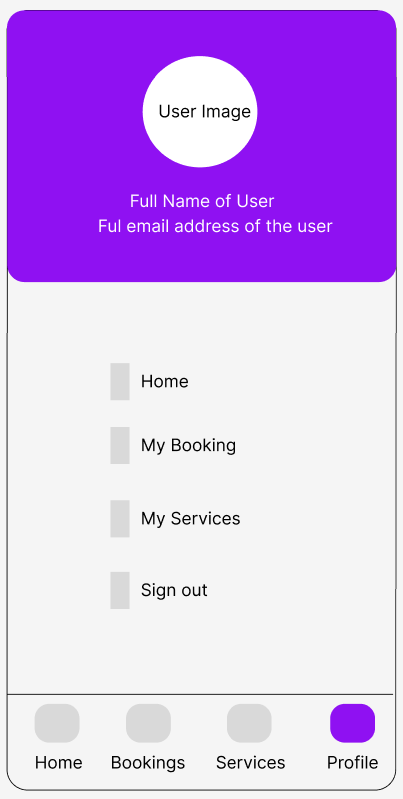  |

> 🧱 *Guided the initial design and ensured responsiveness and ease of use.*

---

## 🖼️ Screenshots of Application

Below are real screenshots of the SkillHire application running on a mobile device:

| Screen                        | Screenshot                                                |
|-------------------------------|------------------------------------------------------------|
| 📱 Login Screen               | 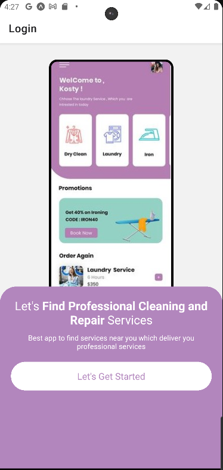                       |
| 🏠 Home Screen                | 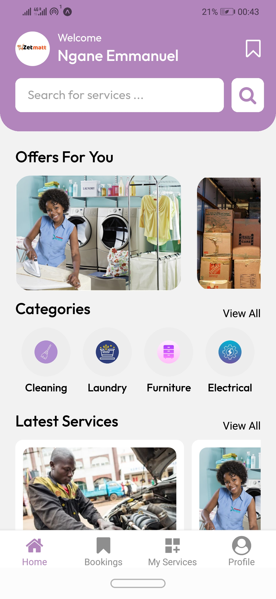                        |
| 🔍 Search Service             | 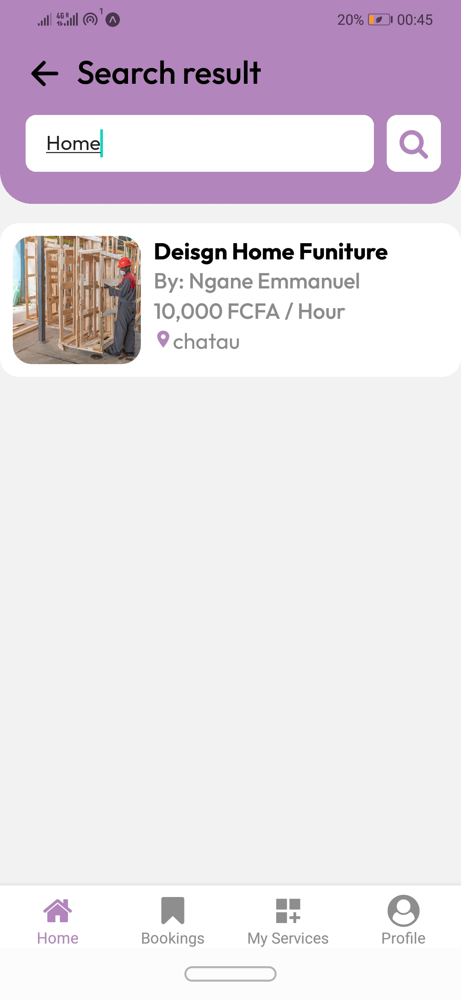                      |
| 🛠️ Service Details           | 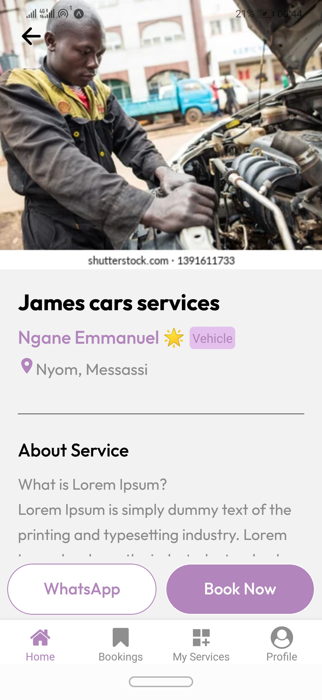             |
| 📆 Booking Page              | 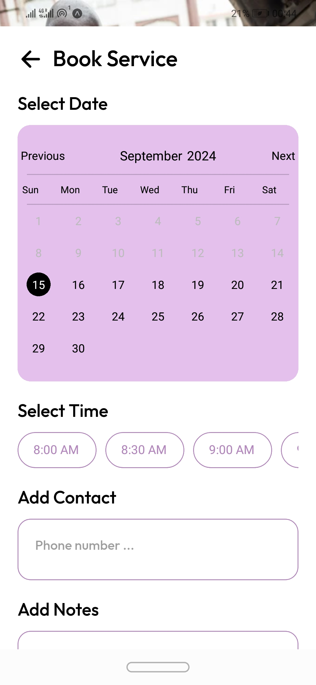                     |
| 📋 My Bookings               | 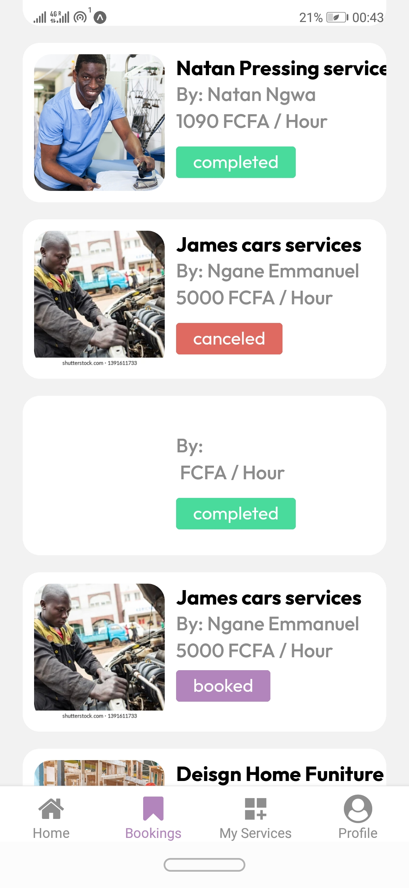                 |
| ➕ Add Service               | 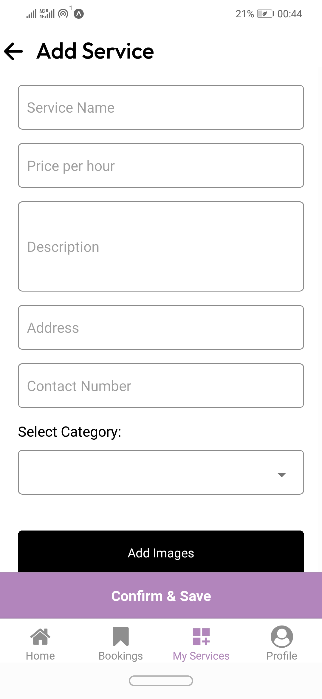                 |
| 👤 Profile Page              | 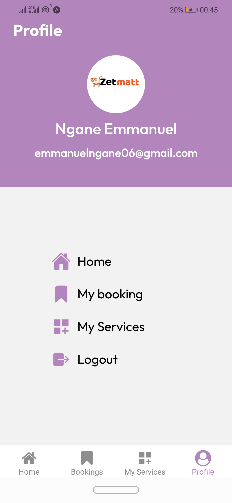                     |

> 📸 *These showcase live application usage, features, and UI styling.*

---

## 🎥 Demo

Watch the live demo on YouTube to see the app in action:

🔗 [Click here to watch the video demo]([https://www.youtube.com/watch?v=YOUR_DEMO_LINK](https://www.youtube.com/watch?v=Zo4SStECzKA))

> 🎯 *Includes walkthroughs of login, booking, messaging, and managing services.*

---

## 📌 Future Improvements

- ✅ **Automated Testing** using Jest and Detox
- ✅ **Push Notifications** for service updates
- ✅ **Service Ratings & Reviews**
- ✅ **Advanced Filtering** (price, distance, availability)
- ✅ **Admin Dashboard** (web version)

---

## ⚙️ Setup Instructions

### 1. Clone the Repository

```bash
git clone https://github.com/NganeEmmanuel/Cleaning-service.git
cd Cleaning-service
```

### 2. Install Dependencies

Make sure you have `node`, `npm`/`yarn`, and `expo` CLI installed.

```bash
npm install
# or
yarn install
```

### 3. Configure Clerk

1. Go to [Clerk.dev](https://clerk.dev) and set up a new application.
2. Replace your Clerk `publishableKey` and `frontendApi` in the `.env` or config file.

### 4. Configure Hygraph

1. Set up your content schema (services, users, bookings) in [Hygraph](https://hygraph.com).
2. Use your GraphQL endpoint in `graphql/client.js`.

### 5. Run the App

```bash
npx expo start
```

Scan the QR code using Expo Go (iOS/Android).

---

## 🧪 Testing

- ✔️ Manual testing across all features (login, search, booking)
- 🧠 API tested using GraphQL Playground
- Future work includes setting up:
  - ✅ Unit tests

---


## 👨‍💻 Author

**Ngane Emmanuel**  
📧 [Email](mailto:emmanuelngane06@gmail.com)  
🔗 [GitHub](https://github.com/NganeEmmanuel) 
🔗 [LinkedIn](https://www.linkedin.com/in/ngane-emmanuel-b25242150/) 

---

## 📄 License

This project is licensed under the MIT License. See the [LICENSE](LICENSE) file for details.

---

## 🔗 GitHub Repository

[https://github.com/NganeEmmanuel/Cleaning-service](https://github.com/NganeEmmanuel/Cleaning-service)

```
